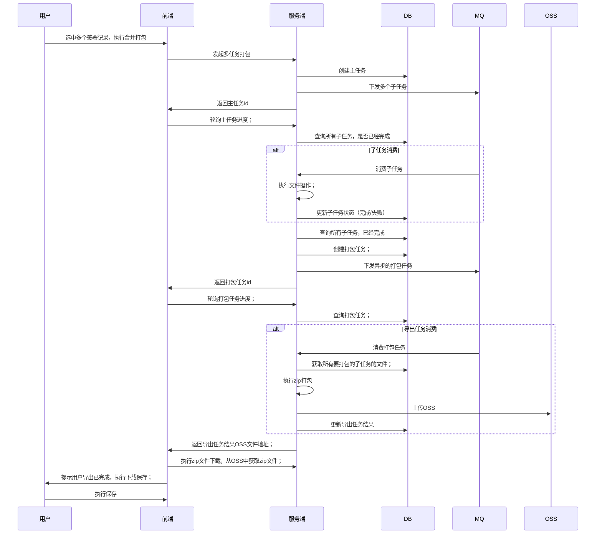

电子签署能力在人事SaaS领域的商业价值不仅体现在效率提升和成本优化上，更通过法律合规、数据智能化、生态协同及可持续发展等维度，这是一个智能化的HR Saas产品的必备能力，也是商业化、增强产品力的很好的一个功能模块。

同时人事业务本身就是电子签署的最大的应用场景，人员流动、合同管理都需要高效的电子签署来支持；

# 1.项目背景

1. 项目背景：现有的基础人事系统缺少电子签署能力，人事领域中的合同、入职、离职、薪资等文件都需要相关的签署业务，电子签项目是为人事提供这样的一个能力；
2. 技术资源背景：一个完整的电子签能力应该包括：法人公司认证、文件模板、电子签署以及电子签署记录生命周期的维护；
	- 项目周期和成本控制：考虑借助公司内部的文档能力或WPS服务来支持文件模板模块、第三方电子签署平台能力（如e签宝平台能力）
	- 人事平台也是由多个应用组合而成（包括：基础版人事、旗舰版、薪酬、招聘等等），因此电子签应该作为平台能力，支持多租户接入；
4. 业务结果：
	- 完整的电子签生命周期：选人、选模板、发起签署、签署消息通知、签署记录台账管理；
	- 业务扩展：以租户模式对接业务方；
	- 商业化结果：xx万/首年。接入企业数100+；

# 2.需求分析及设计

## 功能性设计

1. 法人公司模块：一个企业能够发起电子签，需要有相关的认证公司。
	- 法人公司录入、维护；
	- 法人公司认证：在第三方电子签平台完成认证，并跟踪其认证流程、状态；
	- 法人公司的电子印章维护；
2. 文件模板：各种场景都需要不同的合同模板，合同模板应该具备占位符、自动填充等能力；在此基础上，电子签领域还需要模板具备电子签章的控件能力；
	- 模板制作：可在模板中插入占位符，标识填充的档案字段；
	- 动态填充：模板需要具备根据签署人填充对应的档案数据；
	- 电子签印章控件：自动计算预设好的印章位置，不需要手动拖章。
	- 模板分类管理；
3. 电子签模块：利用法人公司 + 文件模板 + 员工档案，生成PDF，在第三方电子签平台执行签署；
	- 电子签署；
	- 消息通知；
	- 签署记录台账维护；
	- 打包签署文件、导出签署记录等；
4. 平台能力：接入电子签平台，需要提供2个接口：
	- 获取可用占位符：在模板制作时，需要从租户方获取可以用来设置在模板中的占位符；
	- 获取员工数据：根据模板中的占位符 + 员工，从租户方获取档案数据，用于动态渲染模板；
	- 支持配置化的2种接入协议（RPC对内、HTTP对外），根据租户id动态路由。

## 非功能性设计

1. 可靠性：
	- 限流：识别业务流中的瓶颈，预埋限流策略；
	- 失败重试：整个签署过程，异步节点很多，需要支持重试保证幂等，来最大努力交付；
2. 性能考虑：
	- 首先签署场景本身是低频场景，不会有太高的并发和性能诉求；
 	- 耗时：主要在PDF文件生成耗时；
	- 多签署文件打包链路：多文件生成考虑并发处理，每个文件生成后，再打包导出；
	- 10+复杂条件的分页查询：没有搜索引擎的前提下，为避免慢SQL，需要缓存方案；
3. 扩展性：
	- 领域模型能力要内聚；
	- 良好的代码设计、扩展性考虑，可以为后续功能迭代提供效率；
4. 可观测性：
	- 故障监控：关键节点日志和监控，便于问题排查；
	- 商业化数据报表：离线数据 + SQL + 定时任务；

# 3.UseCase示意

## 模板的创建和渲染

一份合同的发起需要3个基本元素：
- 模板文件：企业使用哪一份合同模板文件
- 签署方1：给哪一个员工发起签署；（档案数据）
- 签署方2：签署的相关法人公司；（电子签署印章）

因此只需要准备好「合同模板」，在员工列表中，选定员工即可一键发起合同：


在真正发起之前，HR可以手动调整一些数据，再执行发起动作，发起之后
1. 根据合同模板文件内的档案字段，拉取员工的对应的档案数据；
2. 渲染数据到文件中，并生成真实发起的PDF文件；
3. 将文件发送到「电子签机构服务」。并维护签署记录的状态流转；
4. SMS、协同办公软件、邮件等通知员工方、企业方执行签署；


## 电子签署发起


- HR（管理员）选中员工 + 文件模板后，可以直接发起电子签，平台会根据租户，以及提前配置好的Hook，拉取对应的员工档案。
- 数据 + 模板 => 生成最终要签署的合同文件。最终将文件及印章坐标（图中简化了）发送到电子签服务接口。
- 根据配置在服务提供商的webhook，维护签署文件状态的流转；


# 4.业务架构及详细设计

## 整体业务架构


1. 文件模板、法人公司、电子签署3个领域模型的独立设计；实现高内聚、低耦合；
2. 平台开放能力：电子签平台以租户的形式对外提供服务，租户接入需要实现电子签平台提供的SPI，用于以下场景：
	- 需要从租户获取字段元数据，设计模板时，预置一些占位符，用于后续使用时，自动填充；
 	- 需要从租户获取档案数据，用来填充模板，生成合同文件；
  	- SPI协议：支持RPC（集团内部HSF）、HTTP。根据租户的协议，执行远程调用，获取租户数据；
   	- 对外提供开放接口（HTTP）可查询签署记录；
4. 外部依赖：文档服务、电子签提供商；
	- 针对外部服务（文档和电子签服务提供商）接口，做下防腐设计，防止外部模型腐蚀内部领域模型；

## 领域模型


## 防腐层

目的：
- **隔离外部服务的变化对当前系统的侵蚀**，确保自己服务的领域模型的纯粹性；
- 当外部服务升级、协议变化时，可以统一在防腐层处理，也不会影响到自己的领域结构；
- 在防腐层统一对外部服务的异常进行处理，可以做异常的转换映射、限流、熔断等逻辑；
- 针对依赖的「文档能力」、「电子签能力」可以在防腐层进行适配和切换（如果有的选的话），只需要适配已有的内部领域模型，对上层业务无感知。保持内部逻辑的清晰；

设计：
Client层，屏蔽外部接口：
```java
// Client层
public interface EsignClient {

    EsignStartResponse startEsign(EsignStartRequest request);

	// ...
}
```

外部服务定义的数据模型，只会传递到防腐层，不应向内部模型渗透；通常使用`Adaptor`或者`manager`来隔离；
1. 将外部服务的签署状态转为内部状态；
2. 映射外部服务的错误码到内部服务；
3. 对外部服务执行限流、降级策略；

```java
@Service
public class EsignAdapterImpl implements EsignAdapter {
    @Resource
    private EsignClient esignClient;
    @Override
    @SentinelResource(fallback = "startEsignFallback")
    public HrmEsignRecord startEsign(HrmEsignRecord esignRecord) {
		// 针对要发起的签署记录构建外部请求
		EsignStartRequest esignStartRequest = buildEsignStartRequest(esignRecord);

		// 执行请求发送
		EsignStartResponse esignStartResponse = esignClient.startEsign(esignStartRequest);

		// 处理服务方的响应，构建内部领域的发起后的签署记录（将订单号、状态填充到内部模型）
		HrmEsignRecord hrmEsignRecord = parseEsignResponse(esignStartResponse);	

		return hrmEsignRecord;
    }

    // fallback
    public HrmEsignRecord startEsignFallback(HrmEsignRecord esignRecord) {
        // 降级策略

		return hrmEsignRecord;
    }
}
```

## 数据库
1. MySQL分库分表：16个库，每个分库64张分表；根据企业id由数据库代理进行路由；
2. MySQL合理的建表、索引设计：提前确定好业务的唯一key、不同模块间交互需要用到的关联键，以此来作为索引创建依据。
3. 强一致性场景使用MySQL关系型数据库；如高一致性性核心链路的读写；
4. 弱一致性场景使用分析型数据库，如搜索场景下的复杂模糊查询；

# 5.业务逻辑实现细节

## 租户开放能力设计

在一个完整的电子签署过程中，要经历下图的流程：


在此过程中，有2个节点需要租户来提供数据，因此电子签平台提供2个SPI，让租户接入：
1. 文件模板制作时，其中的<font color="#de7802">占位符由租户提供</font>；
2. 选择用户发起签署时，需要获取文件模板中占位符对应的档案数据，<font color="#de7802">档案数据由租户提供</font>；

租户接入的方式：
1. 集团内的业务方使用RPC方式；通过RPC的泛化调用实现；
2. 集团外的业务方使用HTTP方式，业务方提供一个HTTP接口，根据我们约定的签名方式来鉴权；(平台私钥签名，租户公钥验签)

代码实现：<font color="#f79646">简单工厂 + 动态配置 + RPC泛化调用</font>

简易版本实现，见：[多租户多协议简易代码实现](https://github.com/huiru-wang/backend-code-snippet/tree/main/10-design-pattern/src/main/java/com/example/codesnippet/system/multi_tenant)

## MQ异步打包任务

#### 业务场景
1. 针对签署记录，管理员可以将多个签署记录的文件打包下载为一个zip文件。这些文件可能已经生成了（签署完成了），可能文件还没生成（待签署）。
2. 文件生成本身是一个高耗时动作，平均单个文件5～8s；
3. 这里就有必要做一个并发处理。

#### 实现方案
前端触发多文件打包任务后，服务端会异步创建多个文件生成任务，并发执行文件生成。这里实际上有2种耗时的异步任务：
1. <font color="#de7802">子任务</font>：每个子任务的文件生成；
2. <font color="#de7802">打包任务</font>：多个子任务汇总打包成一个zip（这也是一个耗时任务）

针对第一个问题，MQ异步分发任务即可，然后将生成的文件放入OSS或者DD内部存储，标记任务完成即可。
关键在于第二个任务何时触发，如何感知所有子任务完成了。

方案一：前端2段轮询
- 前端下发主任务后，服务端返回`taskId_1`；作为第一个阶段的轮询id；
- 每次前端轮询`taskId_1`，服务端就查询所有子任务状态，如果全部完成，则触发第二个任务，并返回新任务id：`taskId_2`
- 前端轮询`taskId_2`，完成后，执行文件下载即可。

方案二：前端1段轮询，服务端每个子任务完成后，更新主任务状态，最后一个子任务完成后，触发<font color="#de7802">打包任务</font>；
- 服务端需要处理并发更新主任务状态。
- 由于是分布式场景，如果存在更新抢锁问题，需要不断重试来抢锁，因为不能失败。

方案三：前端1段轮询，每次服务端起一个定时任务，轮询所有子任务状态，成功后结束定时任务并触发<font color="#de7802">打包任务</font>；
- 要为定时任务做一些高可用，比如分布式定时任务调度，防止单机挂了。

综合来说，方案一的复杂度低，灵活度高；

方案一具体实现：
1. 前端下发打包任务；
2. 服务端创建主任务，并发起多个异步子任务，每个子任务异步执行并更新各自的状态，返回主任务id给前端；
3. 前端轮询主任务id，服务端同步查询子任务结果；当所有子任务完成，则下开启1个异步打包问题，返回打包任务id；
4. 服务端打包任务异步执行zip打包；
5. 前端轮询打包任务id，当完成时，执行下载；



## 法人公司认证和状态跟踪

1. 根据法人公司名称，获取e签宝的认证连接；此链接中包含来源，用于认证完成后执行回调；
2. 用户跳转到「e签宝的认证连接」完成认证，此过程在e签宝的业务领域内；（跳出DD）
3. 用户在e签宝完成认证后，e签宝将认证结果通过回调通知给DD；
4. DD接受回调，并更新法人公司的认证状态；

三方回调的接口设计：
1. 根据三方回调接口的规范定义接口；比如POST方法、Content-Type、请求体格式、响应码等；
2. 安全性验证：安全的签名算法验证；如HMAC-SHA256；
3. IP白名单：三方的接口调用通常是指定的几个IP，因此使用白名单方式；
4. 接口幂等：
	1. 请求调用的幂等：应该有一个请求唯一id，来作为并发场景的去重；此id与业务无关，应该用分布式锁对此id加锁来防止请求并发。
	2. 业务的幂等：防止回调重复或三方的错误请求。比如某个请求重复调用、不符合业务的状态流转；
5. 根据回调的处理时长，选择同步、异步处理；如果任务比较耗时，应该在约定的超时时间内先返回，在系统内部进行异步任务处理；比如发出MQ由消费端处理、创建Task由任务调度程序处理。
6. 监控告警：监控业务的流量、RT、成功率、错误统计等。如有异常应该触发告警；
7. 容错：根据第三方是否有重试机制，实现一定的容错。如果没有需要系统内部自行实现，比如失败后由任务调度器重试；

## 复杂查询的深分页问题

背景：
1. 电子签的签署记录台账，是一个搜索场景，可以通过签署人员姓名、签署时间、签署状态、使用的模板、签署的方式等等10+的搜索条件来筛选；
2. 在筛选条件的基础上，还要做数据权限，每个管理员的部门权限范围不同，看到的数据也不同；
3. 业务上预计是未来使用分析性数据库来解决复杂查询条件和深分页问题。但该项目上线时，还没有接入列式数据库。

线上问题的出现：
刚开始业务比较少，没啥问题，在上线几个月后，电子签项目的主力企业已经达到了5000+的签署流水，此时在复杂搜索场景中，已经出现了2s+的慢SQL。用户倒是没反映卡顿，但对于系统还是存在资源占用的风险。

临时方案：分布式缓存做分页；
1. 用户执行首页的查询时（page = 1），根据查询条件、排序规则，一次性查询出2w条数据，将其中的`签署id`取出来放入缓存中；（`签署id是唯一索引`）
2. 用户翻页时，直接在缓存中进行翻页，取出签署id，再从数据库中直接查询详细数据；

效果：
- 用户首次查询时，会比较慢，但后续的翻页查询，都会非常快。
- 相当于将原来多次翻页的系统负载，通过首次查询进行批处理了。
- 存储占用：(UUID 32字节) x 2w = 0.6MB左右；

缺陷：作为临时方案，缓存存储的上限要控制。但从业务上来说，单企业2w已经很多了，大部分企业可能2年也达不到2w；


# 6.稳定性风险及应对

## 核心组件MQ的稳定性

MQ是系统的核心链路中的强依赖，消息堆积如何处理？
1. 是否流量突发引发的堆积？
	1. 如果是<font color="#de7802">正常流量突发</font>，<font color="#de7802">先观察消费者处理性能</font>，如果消费者处理性能正常，不建议介入，MQ本身就是削峰填谷，应该持续观察堆积增速，只要不是堆积量持续加大，都可以不处理。
 	2. <font color="#de7802">正常流量持续增大，堆积数量持续升高</font>，这种就需要考虑在生产侧限流了。同时如果消费者数量 < 分区数（队列数），可以考虑增加消费者数量，或者增大消费者线程数；
	3. 如果是<font color="#4bacc6">异常流量</font>，恶意企业、恶意攻击等，造成生产端产生无效消息，根据<font color="#4bacc6">企业标识，过滤掉恶意流量</font>；
2. 如果不是流量高引发的堆积，比如<u>重试机制导致不断重新消费</u>，引发的堆积，需要明确重试原因，是否能够重试解决？
	1. 可以重试解决：可以降低重试次数，比如只重试1-2次；
	2. 重试不可以解决：针对关键字、错误码不进行重试，直接fast-fail；
3. 以上都应该提前准备好对应的<u>降级开关</u>、<u>错误响应映射</u>等；

## 接口限流

接口限流的系统保护是如何处理的？这里分为2部分考量：
1. 对外部提供服务的限流（QPS）
	1. 目的：<font color="#f79646">恶意流量</font>、<font color="#f79646">保护系统不会外部流量打垮</font>；
	2. 明确限流的维度：企业、个人；
	3. 限流的技术实现：基于Redis的分布式限流；也可以是使用Sentinel的热点规则限流；使用什么方式，取决于当前系统的结构是否合适、基建是否完善、成本等因素；
2. 对内部依赖的服务的消费限流（线程数）
	1. 目的：同样是保护系统，但是是保护系统<font color="#f79646">不被外部服务的不稳定拖垮</font>；
	2. 方式：这里要使用线程数限流，而非QPS，当外部服务RT不稳定，如果不做线程数控制，会导致启动更多的线程，占用系统资源；
	3. 具体可以自行在业务中构建线程池，设定上限；也可以使用Sentinel的线程数限流能力，直接配置化对应的接口即可；

## 项目风险管理

由于交付时间问题，项目有多人完成，按照模块划分，可并行开发；

项目前：
1. 详细分解技术方案，分工明确；
2. 识别项目中可能的卡点，特别关注，提前验证；（对接e签宝）
项目中：
3. 每日进度对其，随时倾斜人力；
4. 项目进度要透明，才能控制风险；
项目后：
5. 同前线交付人员保持密切沟通，有问题随时处理；

